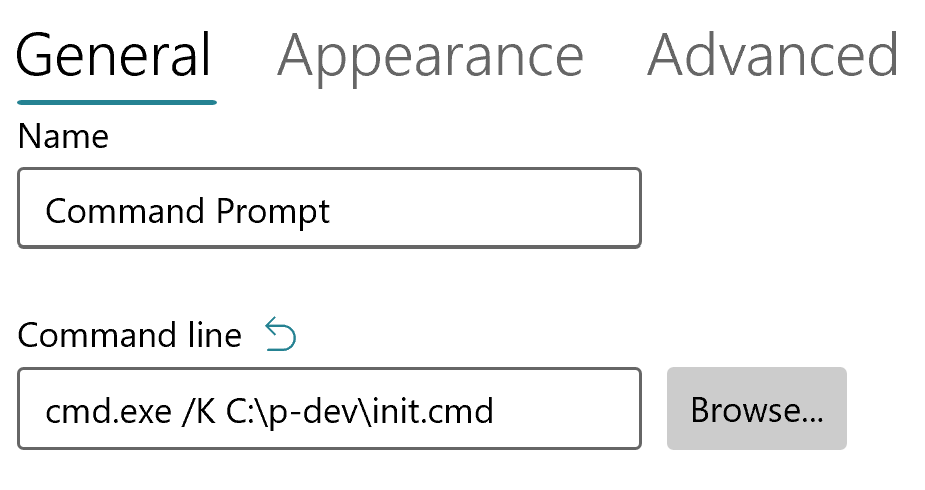

# Windows terminal

### Add aliases (macros)
- Create new executable file (for example init.cmd)
- Add macros, for example:
```
@echo off 
doskey k=kubectl $*
doskey d=docker $*
doskey ga=git add $*
doskey gp=git pull
doskey gb=git branch
doskey gs=git status
doskey gd=git diff
doskey gco=git checkout $1
doskey gocb=git checkout -b $1
doskey gpo=git pull origin $1
doskey gc=git commit -a -m "$*"
doskey cdp=cd c:\p-dev
doskey cdd=cd c:\dev
doskey cdl=cd c:\l-dev
doskey ls=dir /a
doskey gcob=git checkout -b $*
doskey aliases=code c:\p-dev\init.cmd
doskey mkcd=mkdir $1 ^&^& cd $1
doskey e=explorer $1
doskey h=doskey /h

REM Azure-cli
doskey azlocation=az account list-locations --query "[?contains(name, '$1')].{Name:name, DisplayName:displayName}" --output table
```
- Open terminal => Settings => Command Prompt
- Fill `cmd.exe /K C:\p-dev\init.cmd` in the Command line input:   